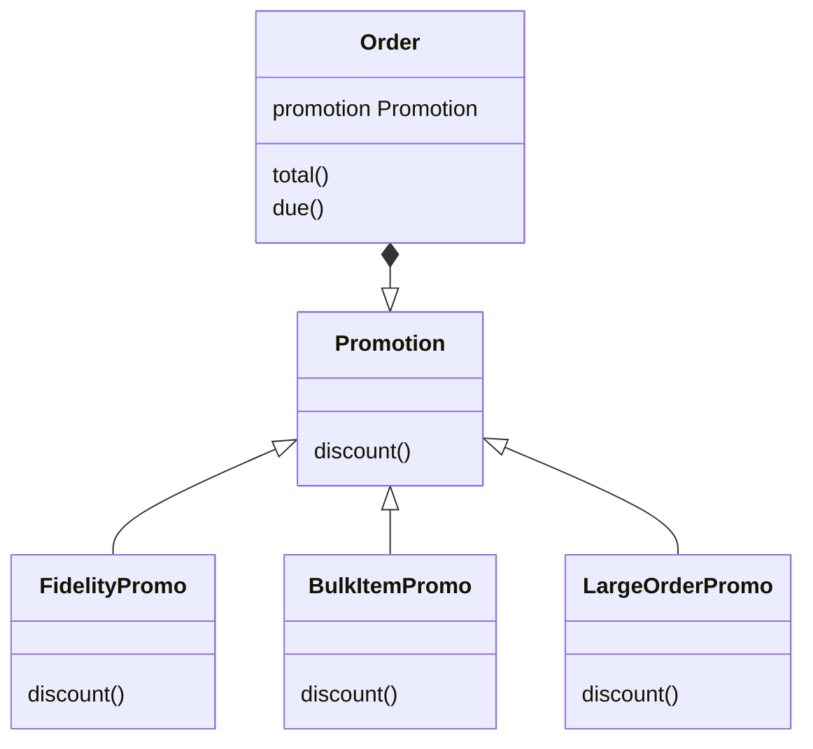

# Design Patterns with First-Class Functions

## Stategy 패턴 리팩토링하기.

### 고전적인 방법의 Strategy 패턴
- class를 이용한다.



- 위의 UML로 Promotion을 클래스로 구현할 수 있다.
```python
from abc import ABC, abstractmethod
from collections.abc import Sequence
from decimal import Decimal
from typing import NamedTuple, Optional


class Customer(NamedTuple):
    name: str
    fidelity: int


class LineItem(NamedTuple):
    product: str
    quantity: int
    price: Decimal

    def total(self) -> Decimal:
        return self.price * self.quantity


class Order(NamedTuple):  # the Context
    customer: Customer
    cart: Sequence[LineItem]
    promotion: Optional['Promotion'] = None

    def total(self) -> Decimal:
        totals = (item.total() for item in self.cart)
        return sum(totals, start=Decimal(0))

    def due(self) -> Decimal:
        if self.promotion is None:
            discount = Decimal(0)
        else:
            discount = self.promotion.discount(self)
        return self.total() - discount

    def __repr__(self):
        return f'<Order total: {self.total():.2f} due: {self.due():.2f}>'


class Promotion(ABC):  # the Strategy: an abstract base class
    @abstractmethod
    def discount(self, order: Order) -> Decimal:
        """Return discount as a positive dollar amount"""


class FidelityPromo(Promotion):  # first Concrete Strategy
    """5% discount for customers with 1000 or more fidelity points"""

    def discount(self, order: Order) -> Decimal:
        rate = Decimal('0.05')
        if order.customer.fidelity >= 1000:
            return order.total() * rate
        return Decimal(0)


class BulkItemPromo(Promotion):  # second Concrete Strategy
    """10% discount for each LineItem with 20 or more units"""

    def discount(self, order: Order) -> Decimal:
        discount = Decimal(0)
        for item in order.cart:
            if item.quantity >= 20:
                discount += item.total() * Decimal('0.1')
        return discount


class LargeOrderPromo(Promotion):  # third Concrete Strategy
    """7% discount for orders with 10 or more distinct items"""

    def discount(self, order: Order) -> Decimal:
        distinct_items = {item.product for item in order.cart}
        if len(distinct_items) >= 10:
            return order.total() * Decimal('0.07')
        return Decimal(0)
```
- strategy 객체는 좋은 flyweight가 될 때가 많다.
  - flyweight 패턴은,
    - 여러 객체가 생성되어야 하는데, 동일한 기능을 가질 때
    - 하나의 객체를 여러 상황에서 사용하는 것.
    - 이 하나의 객체를 flyweight라고 한다.
- 위의 클래스를 통한 구현은 flyweight 패턴이 아니다.
  - `Order`를 생성할 때마다 새로운 `Promotion` 객체가 생긴다.
  - 따라서 flyweight로 구현하는 것이 좋다.
  - 패턴 자체의 단점을 보완하기 위하여 다른 패턴을 사용하여야 한다.
    - 이는 코드양과 유지보수 부담을 늘린다.

### 함수 지향 Strategy 패턴
일부를 다음과 같이 수정하면 된다.
```python
...

class Order(NamedTuple):
    ...
    promotion: Optional[Callable[['Order'], Decimal]] = None

    ...
    def due(self) -> Decimal:
        if self.promotion is None:
            discount = Decimal(0)
        else:
            discount = self.promotion(self)
        return self.total() - discount

...

def fidelity_promo(order: Order) -> Decimal:  # <4>
    """5% discount for customers with 1000 or more fidelity points"""
    if order.customer.fidelity >= 1000:
        return order.total() * Decimal('0.05')
    return Decimal(0)


def bulk_item_promo(order: Order) -> Decimal:
    """10% discount for each LineItem with 20 or more units"""
    discount = Decimal(0)
    for item in order.cart:
        if item.quantity >= 20:
            discount += item.total() * Decimal('0.1')
    return discount


def large_order_promo(order: Order) -> Decimal:
    """7% discount for orders with 10 or more distinct items"""
    distinct_items = {item.product for item in order.cart}
    if len(distinct_items) >= 10:
        return order.total() * Decimal('0.07')
    return Decimal(0)
```
- 객체가 함수로 대체되었다.
- strategy 객체의 내부 상태가 없으며, 단 하나의 메소드만 가지기 때문에 함수로 대체할 수 있다.

## "metastrategy": 가장 좋은 strategy 고르기

### 간단한 해결책
```python
Order(joe, long_cart, best_promo)
```
- 가장 좋은 promotion을 자동으로 계산해주는 best_promo 함수를 만들어보자.
```python
promos = [fidelity_promo, bulk_item_promo, large_order_promo]

def best_promo(order: Order) -> Decimal:
    """Compute the best discount available"""
    return max(promo(order) for promo in promos)
```
- promotion 함수를 만들 때마다 `promos`를 업데이트해야한다. 그렇지 않으면 버그가 발생할 것이다.

### 모듈에서 불러오기
```python
...
import strategy import (
  fidelity_promo, bulk_item_promo, large_order_promo
)

promos = [promo for name, promo in globals().items()
                if name.endswith('_promo') and
                   name != 'best_promo'
]

def best_promo(order: Order) -> Decimal
    ...
```
- `globals()`
  - 현재 모듈의 전역 심벌 테이블을 나타내는 딕셔너리를 리턴한다.
  - 함수나 메소드 내부에서는, 이것이 정의된 모듈이며, 호출된 모듈을 가리키지 않는다.
- `_promo`로 끝나는 모든 함수를 가져온다.
  - 이름이 잘못되거나 내용이 잘못된 함수를 만들 위험이 있다.
- `inspect`를 이용하는 또 다른 방법이 있다.
```python
...
import inspect

...
import promotions

promo = [func for _, func in inspect.getmembers(promotions, inspect.isfunction)]
...
```
- `inspect.getmembers`는 객체의 속성을 리턴한다.
  - 두 번째 선택적 인자는 predicate이다.
- 이름에 상관없이 함수를 불러온다.
  - 모듈에 잘못된 함수를 넣을 위험이 있다.

### 데코레이터로 `best_promo`구현하기
```python
Promotion = Callable[[Order], Decimal]

promos: list[Promotion] = []


def promotion(promo: Promotion) -> Promotion:
    promos.append(promo)
    return promos


@promotion
def fidelity(order: Order) -> Decimal:
    ...

@promotion
def bulk_item(order: Order) -> Decimal:
    ...

@promotion
def large_order(order: Order) -> Decimal:
    ...
```
- 다음 장점이 있다.
  - strategy 함수들은 더 이상 특별한 접미사를 붙이지 않아도 된다.
  - 데코레이터가 그 의미를 대신한다.
  - 데코레이터를 주석으로 바꾸면 해당 strategy를 목록에서 잠시 제거할 수 있다.
  - 다른 모듈에서 정의된 strategy도 등록할 수 있다.

## Command 패턴
- Command는 콜백의 객체지향적 대체제이다.
- 단순한 command는 함수로 만들 수 있다.
- 복잡하고 내부 상태가 필요한 command는 `__call__` 함수를 구현함으로써 Callable로 만들 수 있다.