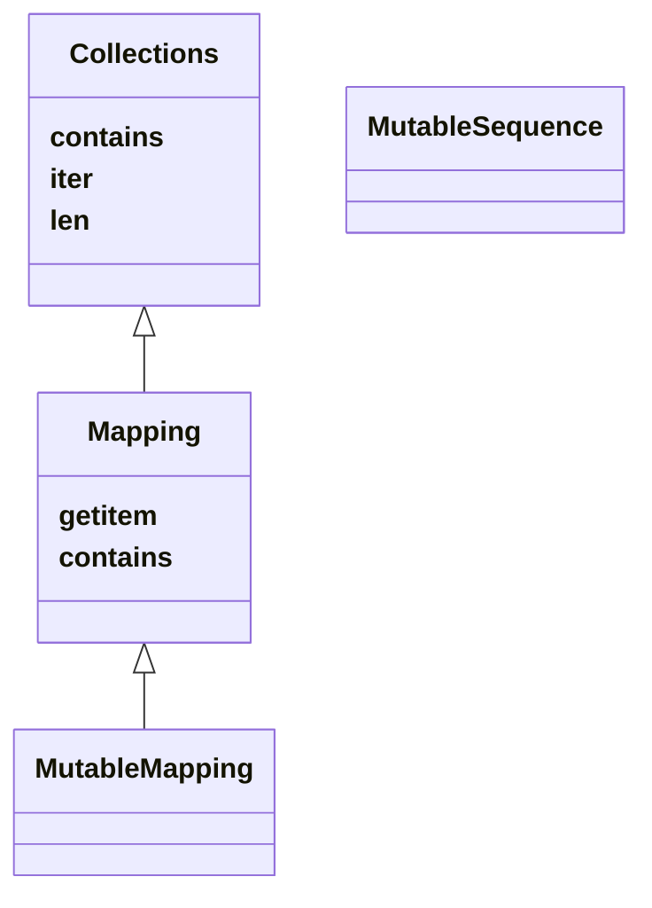

# 3. Dictionaries and Sets
- Dictionary는 python의 근원적 데이터 타입이다.
  - class의 attribute, module namespace, function keyward argument 등은 메모리에서 dict로 표현된다.
  - `__builtins__.__dict__`는 built-in 타입, 객체, 함수들을 담고 있다.
- 이러한 이유 때문에 고도로 최적화되어있고 지속적으로 개선되고 있다.
- `dict`, `set`, `frozenset` 역시 hash table로 이루어져 있다.
- python의 set은 set theory의 기본 연산을 모두 담고있다.
  - 이는 nested loop, 조건문 등을 많이 줄여준다.

이 장에서 다룰 것은
- 여러 dict 종류와 & mapping
  - 향상된 unpacking과 pattern matching 등 modern syntax를 다룬다.
- mapping 타입의 공통 메소드
- 존재하지 않는 key의 특수 처리
- standard library의 dict 변종들
- set, frozenset 타입
- set과 dictionary에서 hash table의 영향

## Modern dict Syntax

### `dict` comprehensions (dictcomp)
- iterable에서 key:value 쌍을 뽑아내어 dict를 만든다.
```python
>>> dial_codes = [
...     (880,  'Bangladesh'),
...     (55,   'Brazil'),
...     (86,   'China'),
...     (91,   'India'),
...     (62,   'Indonesia'),
...     (81,   'Japan'),
...     (234,  'Nigeria'),
...     (92,   'Pakistan'),
...     (7,    'Russia'),
...     (1,    'United States'),
... ]
>>> country_dial = {country: code for code, country in dial_codes}
>>> country_dial
{'Bangladesh': 880, 'Brazil': 55, 'China': 86, 'India': 91, 'Indonesia': 62, 'Japan': 81, 'Nigeria': 234, 'Pakistan': 92, 'Russia': 7, 'United States': 1}
>>> {code: country.upper() for country, code in sorted(country_dial.items()) if code < 70}
{55: 'BRAZIL', 62: 'INDONESIA', 7: 'RUSSIA', 1: 'UNITED STATES'}
```

### Unpacking Mappings
- `**`를 통해서 함수 인자에 dictionary를 Unpacking할 수 있다.
  - key는 겹치면 안 된다.
```python
>>> def dump(**kwargs):
...     return kwargs
... 
>>> dump(**{'x': 1}, y=2, **{'z': 3})
{'x': 1, 'y': 2, 'z': 3}
```

- `**`를 dict literal에서 사용할 수 있다.
  - 이 경우 중복 key는 마지막 key:value로 덮어 씌워진다.
```python
>>> {'a': 0, **{'x': 1}, 'y': 2, **{'z': 3, 'x': 4}}
{'a': 0, 'x': 4, 'y': 2, 'z': 3}
```

### `|`를 이용하여 mapping 합치기
- `|`나 `|=`를 이용해서 합집합 연산자처럼 mapping을 합칠 수 있다.
  - 보통 새로운 mapping의 타입은 왼쪽 피연산자의 타입이다.
    - 사용자 정의 class의 경우에는 다를 수 있다.

- `|`는 겹치는 key가 있을 경우 뒤쪽 value로 덮어 씌워진다.
```python
>>> d2 = {'a': 2, 'b': 4, 'c': 6}
>>> d1 = {'a': 1, 'b': 3}
>>> d2 = {'a': 2, 'b': 4, 'c': 6}
>>> d1 | d2
{'a': 2, 'b': 4, 'c': 6}
```
- in-place operation을 위해서는 `|=`를 사용한다.
```python
>>> d1
{'a': 1, 'b': 3}
>>> d2
{'a': 2, 'b': 4, 'c': 6}
>>> d1 |= d2
>>> d1
{'a': 2, 'b': 4, 'c': 6}
```

### Mapping을 이용한 pattern matching
- mapping을 이용해서도 pattern matching을 할 수 있다.
- mapping pattern은 dict literal처럼 생겼다.
  - `collections.abc.Mapping`의 subclass는 전부 매칭될 수 있다.
```python
def get_creators(record: dict) -> list:
    match record:
        case {'type': 'book', 'api': 2, 'authors': [*names]}:
            return names
        case {'type': 'book', 'api': 1, 'author': name}:
            return name
        case {'type': 'book'}:
            raise ValueError(f"Invalid 'book' record: {record!r}")
        case {'type': 'movie', 'director': name}:
            return [name]
        case _:
            raise ValueError(f'Invalid record: {record!r}')
```
- 위의 예제는 json같이 반구조화 데이터를 다루는 실용적 방법을 다룬다.
  - record의 종류를 나타내는 field를 포함한다.
  - schema version을 나타내는 field를 포함한다.
  - 특정 타입의 잘못된 record나 해당하는 패턴이 없으면 에러를 raise한다.
- 패턴의 키 순서는 상관없다. `OrderedDict`에서도 그렇다.

- sequence pattern과는 다르게 mapping pattern은 일부분만 매칭되어도 적용된다.
  - 따라서 정확한 매칭을 위해 `**extra`같은 것을 사용할 필요는 없다.
  - 사용할 수도 있다. 나머지 mapping이 필요한 경우 `**`를 사용하면 dictionary로 얻을 수 있다.
- pattern matching은 `d.get(key, sentinel)`로 값을 얻어온다.

### mapping type의 standard API
- `collections.abc.Mapping`과 `collections.abc.MutableMapping`은 dict와 유사 타입의 인터페이스를 제공한다.
