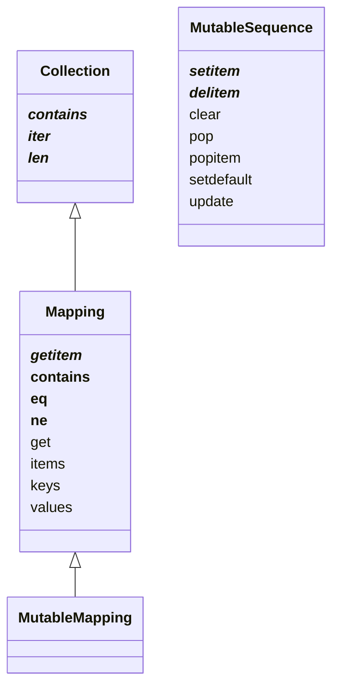
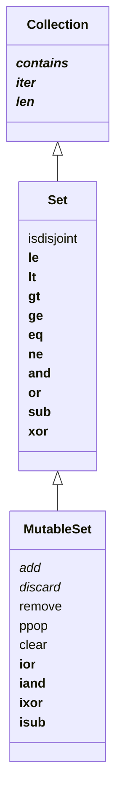

# 3. Dictionaries and Sets
- Dictionary는 python의 근원적 데이터 타입이다.
  - class의 attribute, module namespace, function keyward argument 등은 메모리에서 dict로 표현된다.
  - `__builtins__.__dict__`는 built-in 타입, 객체, 함수들을 담고 있다.
- 이러한 이유 때문에 고도로 최적화되어있고 지속적으로 개선되고 있다.
- `dict`, `set`, `frozenset` 역시 hash table로 이루어져 있다.
- python의 set은 set theory의 기본 연산을 모두 담고있다.
  - 이는 nested loop, 조건문 등을 많이 줄여준다.

이 장에서 다룰 것은
- 여러 dict 종류와 & mapping
  - 향상된 unpacking과 pattern matching 등 modern syntax를 다룬다.
- mapping 타입의 공통 메소드
- 존재하지 않는 키의 특수 처리
- standard library의 dict 변종들
- set, frozenset 타입
- set과 dictionary에서 hash table의 영향

## Modern dict Syntax

### `dict` comprehensions (dictcomp)
- iterable에서 key:value 쌍을 뽑아내어 dict를 만든다.
```python
>>> dial_codes = [
...     (880,  'Bangladesh'),
...     (55,   'Brazil'),
...     (86,   'China'),
...     (91,   'India'),
...     (62,   'Indonesia'),
...     (81,   'Japan'),
...     (234,  'Nigeria'),
...     (92,   'Pakistan'),
...     (7,    'Russia'),
...     (1,    'United States'),
... ]
>>> country_dial = {country: code for code, country in dial_codes}
>>> country_dial
{'Bangladesh': 880, 'Brazil': 55, 'China': 86, 'India': 91, 'Indonesia': 62, 'Japan': 81, 'Nigeria': 234, 'Pakistan': 92, 'Russia': 7, 'United States': 1}
>>> {code: country.upper() for country, code in sorted(country_dial.items()) if code < 70}
{55: 'BRAZIL', 62: 'INDONESIA', 7: 'RUSSIA', 1: 'UNITED STATES'}
```

### Unpacking Mappings
- `**`를 통해서 함수 인자에 dictionary를 Unpacking할 수 있다.
  - key는 겹치면 안 된다.
```python
>>> def dump(**kwargs):
...     return kwargs
... 
>>> dump(**{'x': 1}, y=2, **{'z': 3})
{'x': 1, 'y': 2, 'z': 3}
```

- `**`를 dict literal에서 사용할 수 있다.
  - 이 경우 중복 key는 마지막 key:value로 덮어 씌워진다.
```python
>>> {'a': 0, **{'x': 1}, 'y': 2, **{'z': 3, 'x': 4}}
{'a': 0, 'x': 4, 'y': 2, 'z': 3}
```

### `|`를 이용하여 mapping 합치기
- `|`나 `|=`를 이용해서 합집합 연산자처럼 mapping을 합칠 수 있다.
  - 보통 새로운 mapping의 타입은 왼쪽 피연산자의 타입이다.
    - 사용자 정의 class의 경우에는 다를 수 있다.

- `|`는 겹치는 key가 있을 경우 뒤쪽 value로 덮어 씌워진다.
```python
>>> d2 = {'a': 2, 'b': 4, 'c': 6}
>>> d1 = {'a': 1, 'b': 3}
>>> d2 = {'a': 2, 'b': 4, 'c': 6}
>>> d1 | d2
{'a': 2, 'b': 4, 'c': 6}
```
- in-place operation을 위해서는 `|=`를 사용한다.
```python
>>> d1
{'a': 1, 'b': 3}
>>> d2
{'a': 2, 'b': 4, 'c': 6}
>>> d1 |= d2
>>> d1
{'a': 2, 'b': 4, 'c': 6}
```

### Mapping을 이용한 pattern matching
- mapping을 이용해서도 pattern matching을 할 수 있다.
- mapping pattern은 dict literal처럼 생겼다.
  - `collections.abc.Mapping`의 subclass는 전부 매칭될 수 있다.
```python
def get_creators(record: dict) -> list:
    match record:
        case {'type': 'book', 'api': 2, 'authors': [*names]}:
            return names
        case {'type': 'book', 'api': 1, 'author': name}:
            return name
        case {'type': 'book'}:
            raise ValueError(f"Invalid 'book' record: {record!r}")
        case {'type': 'movie', 'director': name}:
            return [name]
        case _:
            raise ValueError(f'Invalid record: {record!r}')
```
- 위의 예제는 json같이 반구조화 데이터를 다루는 실용적 방법을 다룬다.
  - record의 종류를 나타내는 field를 포함한다.
  - schema version을 나타내는 field를 포함한다.
  - 특정 타입의 잘못된 record나 해당하는 패턴이 없으면 에러를 raise한다.
- 패턴의 키 순서는 상관없다. `OrderedDict`에서도 그렇다.

- sequence pattern과는 다르게 mapping pattern은 일부분만 매칭되어도 적용된다.
  - 따라서 정확한 매칭을 위해 `**extra`같은 것을 사용할 필요는 없다.
  - 사용할 수도 있다. 나머지 mapping이 필요한 경우 `**`를 사용하면 dictionary로 얻을 수 있다.
- pattern matching은 `d.get(key, sentinel)`로 값을 얻어온다. 따라서 존재하지 않는 키의 처리가 일어나지 않는다.

### mapping type의 standard API
- `collections.abc.Mapping`과 `collections.abc.MutableMapping`은 dict와 유사 타입의 인터페이스를 제공한다.

- custom mapping 타입을 만들 때에는 abc를 구현하는 것보다 `collections.UserDict`를 사용하거나 `dict`를 래핑하는 것이 쉽다.
  - `collections.UserDict`와 모든 구체 mapping class는 내부 구현에 기본 dict를 사용한다.
  - 이는 hash table을 기반으로 한다.
  - 따라서 key는 _hashable_ 해야한다.

#### hashable이란?
- hashable이려면
  - hash code가 생애주기 동안 변하지 않는다.
    - `__hash__()` 메소드가 있어야 hash code를 얻을 수 있다.
  - 다른 객체와 비교할 수 있어야 한다.
    - `__eq__()` 메소드를 필요로 한다.

- 숫자 타입과 str, bytes는 hashable이다.
- container 타입은 immutable이며 모든 내부 object가 hashable이면 hashable이다.
- frozenset은 언제나 hashable이다.
  - 왜냐하면 frozenset의 모든 요소는 hashable이어야 하기 때문.

- python 버전이나 아키텍처에 따라 hash code는 달라질 수 있다.
  - 보안 상의 이유로 붙여지는 salt값 때문에.
- 사용자 정의 type은 기본적으로 hashable하다.
  - hash code는 `id()`이다.
  - `__eq__()` 메소드는 `object` 클래스에서 상속된다.
    - object id를 비교한다.

### `dict`, `defaultdict`, `OrderedDict`

#### 셋의 공통점
- `.clear()`, `.copy()`
- (key) `in` (dict) 연산자를 지원한다. (`.__contains(k)`)
- `del` (dict)`[`(key)`]`연산자를 지원한다. (`.__delitem__(k)`)
- `.fromkeys(it, [initial])`
  - 이터러블 `it`의 요소를 key로 하고 value가 `intial`(default=`None`)인 같은 타입의 Mapping을 만든다.
- `.get(k, [default])`
  - 키 `k`의 값을 가져온다. 없는 경우 `default`값을 가져오며, default가 설정되지 않은 경우 `None`을 가져온다.
- (dict)`[`(key)`]`를 통해 값을 가져올 수 있다.
  - 키에 해당하는 값을 가져온다.
  - 키가 없으면 `KeyError`를 던진다.
- `.items()`
  - `(key, value)` 쌍을 view로 리턴한다.
- `iter` 함수 지원
  - 키를 iterable로 가져온다. (`.__iter__()`)
- `.keys()`
  - 키를 view로 가져온다.
- `.values()`
  - 값들의 view로 가져온다.
- `len` 함수 지원
- `|`, `|=` 연산자 지원.
- `.pop(k, [default])`
  - `k`에 해당하는 요소를 제거하고 그 값을 리턴한다.
  - `default`가 설정되어 있으면 `default`값을, 아니면 `None`을 반환한다.
- `.popitem()`: 마지막으로 삽입된 요소를 제거하고 `(key, value)` tuple로 반환한다.
  - `OrderedDict.popitem(last=False)`는 첫 번째로 삽입된 요소를 제거하고 반환한다.
- `reverse` 함수를 지원한다.
  - key의 iterable을 마지막부터 삽입된 순서로 리턴한다.
- `.setdefault(k, [default])
  - `k in d`가 `True`라면 `d[k]`를 리턴한다.
  - `False`라면 default(혹은 `None`)을 리턴한다.
- (dict)`[`(key)`] = `(value)를 통해 값을 설정할 수 있다. (`.__setitem__(k, v)`)
- `.update(m, [**kwargs])`
  - mapping이나 `(key, value)`로 이루어진 iterable로 값을 업데이트한다.
  - `.keys()` 메소드가 있으면 mapping으로 판단한다.
  - 그렇지 않으면 iterable로 판단하고 그 요소가 `(key, value)`로 이루어져있다고 간주한다.

#### `defaultdict`만의 특징
- `.__copy__()` 매직 메소드가 있어서 copy.copy를 지원한다.
- `.default_factory` callable attribute가 있다.
  - `.__missing__(k)`에서 호출되어 기본 값을 설정하는데 이용된다.
  - `defaultdict`가 인스턴스화 될 때 사용자에 의해 설정되어야 하는 callable 값이다.
- `.__missing__(k)`
  - `__getitem__(k)`가 키 값을 찾지 못할 때 호출된다.
#### `OrderedDict`만의 특징
- `.move_to_end(k, [last])`
  - `k`에 해당하는 요소를 첫번째나 마지막으로 옮긴다.
  - `last`의 기본값은 `True`이다.

#### mapping 타입의 constructor
- mapping 타입들의 constructor는 대부분 `.update`의 로직을 따른다.


### Mutable 값의 삽입과 업데이트
n.b. python은 fast-fail의 철학을 가지고 있다.
- mutable value를 가져와서 업데이트하고 싶은 경우가 있다.
  - `d[k] = func(d[k])`는 빠른 방법이지만 `KeyError`를 던질 가능 성이 있다.
  - `d.get(k, default)`을 통해 가져오는 방법도 있다.
- `word`를 key로 가지는 값에 `location`을 append하는 방법
```python
occurences = index.get(word, [])
occurences.append(location)
index[word] = occurences
```
- 더 나은 방법이 있다.
```python
index.setdefault(word, []).append(location)
```
이것은 다음과 같다.
```python
if word not in index:
    index[word] = []
index[word].append(location)
```
단, 후자의 경우는 `word`를 두 번, 혹은 세 번 검색한다; 전자는 한 번 검색한다.

## 존재하지 않는 키 자동 처리
- 존재하지 않는 키를 검색했을 때 기본값이 설정되도록 하고 싶을 때가 있다.
  - `defaultdict`를 사용할 수 있다.
  - 또는 mapping에 `__missing__` 메소드를 정의할 수 있다.

### `defaultdict`
- `collections.defaultdict`의 인스턴스는 `d[k]`에서 존재하지 않는 키를 사용하면 기본값을 설정해준다.
- `defaultdict`를 사용하면 위의 예시를 다음과 같이 간단히 쓸 수 있다.
```python
index = collections.defaultdict(list)
...
index[word].append(location)
```
- `collections.defaultdict`의 constructor는 callable을 인자로 받는다.
  - 이 callable은 `dd.default_factory` attribute가 된다.
  - `dd[new-key]`에서, `new-key`가 `dd`에 존재하지 않을 때 그 값을 default_factory를 이용하여 설정한다.
  - 그 리턴값의 레퍼런스가 리턴된다.
  - 이때, default_factory가 인자를 받는 함수이면 호출될 때마다 오류가 난다.
  - default_factory가 없다면 존재하지 않는 키로 호출할 경우 `KeyError`가 발생한다.
- `dd.get(k)`로는 default_key가 호출되지 않는다.

### `__missing__` 메소드
- `__missing__` 메소드는 기본 dict에서 구현되어 있지 않다. 하지만 `dict.__getitem__`에서 `__missing__`이 존재하고 키가 존재하지 않으면 `KeyError`를 발생시키지 않고 `__missing__`을 호출한다.

- 값을 찾을 때 key 자리에 숫자도 넣고 str도 넣을 수 있는 dict를 만들어보자.
- 다음과 같은 행동을 한다.
```python
>>> d = StrKeyDict0([('2', 'two'), ('4', 'four')])
>>> d['2']
'two'
>>> d[4]
'four'
>>> d[1]
Traceback (most recent call last):
  ...
KeyError: '1'
>>> d.get('2')
'two'
>>> d.get(4)
'four'
>>> d.get(1, 'N/A')
'N/A'
>>> 2 in d
True
>>> 1 in d
False
```
- 다음과 같이 구현할 수 있다.
```python
class StrKeyDict0(dict):

    def __missing__(self, key):
        if isinstance(key, str):
            raise KeyError(key)
        return self[str(key)]
    
    def get(self, key, default=None):
        try:
            return self[key]
        except KeyError:
            return default
    
    def __contains__(self, key):
          return key in self.keys() or str(key) in self.keys()
```
- `collections.UserDict`를 통해 구현하는 법이 더 좋은 방법이다.
  - 이 예제에서는 `__getitem__`이 `__missing__`을 지원함을 보이기 위하여 dict를 상속시킴.
- `__contains__`에서 `key in self`를 사용하지 않은 이유는 recursive call을 막기 위하여.


### standard library에서 `__missing__`의 행동

- `dict` 파생 클래스
  - `__missing__`만 구현하고 다른 추가적인 메소드는 구현하지 않은 경우에,
    - `__missing__`은 `d[k]`의 형태에서만 호출된다.
    - `__getitem__`이 `dict`에서 상속되었기 때문
- `collections.UserDict` 파생 클래스
  - `__missing__`만 구현하고 다른 추가적인 메소드는 구현하지 않은 경우에,
  - `d[k]`와 `.get`에서 모두 호출된다.
    - `collections.UserDict`의 `.get`은 `__getitem__`을 호출하기 때문
- `abc.Mapping`의 파생 클래스 (최소한의 메소드 구현)
  - `__getitem__`이 `__missing__`을 호출하지 않는 경우
    - `__missing__`은 호출되는 경우가 없다.
  - `__getitem__`이 `__missing__`을 호출하는 경우
    - `__missing__`은 `d[k]`, `d.get(k)`, `k in d`의 경우에 호출될 수 있다.

- 위의 경우들은 최소의 구현만을 가정한 것이다.
  - `__getitem__`, `get`, `__contains__`를 각각 구현한 경우 구현에서 `__missing__`을 호출하는지 아닌지에 따라 결과가 달라질 것이다.
  - 기본적으로 무슨 행동을 하는지 유념할 것

## `dict`의 variation
- `defaultdict`는 이미 다뤘으므로 제외

### `collections.OrderedDict`
- built-in `dict`도 key 삽입 순서를 보존하므로, ordered dict는 하휘 호환을 위해 쓰인다.
- 여전히 남아있는 차이점이 있다.
  - 동등 연산시 `OrderedDict`는 삽입 순서도 비교한다.
  - `.popitem(last=True)`. `last` 키워드 인자가 있다.
  - `.move_to_end(key, last=True)`가 있다.
  - `dict`와 `OrderedDict`는 각각 특정 연산들에 최적화되어있다.
    - `dict`는 mapping 연산에 최적화되어있으며, 순서 보존은 최적화 우선 순위가 낮다.
    - `OrderedDict`는 순서 변환에 최적화되어있다. 공간 효율성, iteration 속도, update 연산의 성능은 우선 순위가 낮다.
  - 알고리즘적으로 잦은 요소 재배치는 `dict`보다 `OrderedDict`가 빠르다.
    - LRU cache등을 만드는데 활용될 수 있다.

### `collections.ChainMap`
- `ChainMap`은 mapping의 list를 가지고 있다.
  - mapping의 순서는 constructor의 인자 순서에 의해 결정된다.
  - mapping 중 하나에서 원소를 찾으면 값을 리턴한다.
- 값을 복사하지 않고 reference를 리턴한다.
  - 값을 바꾸는 경우 첫 번째 mapping만 값이 바뀐다.
```python
>>> d1 = dict(a=1, b=3)
>>> d2 = dict(a=2, b=4, c=6)
>>> from collections import ChainMap
>>> chain = ChainMap(d1, d2)
>>> chain['a']
1
>>> chain['c']
6
>>> chain['c'] = -1
>>> d1
{'a': 1, 'b': 3, 'c': -1}
>>> d2
{'a': 2, 'b': 4, 'c': 6}
```
- 중첩된 scope를 가지는 언어의 interpreter를 만드는데 사용될 수 있다.

### `collections.Counter`
- 각 키의 개수를 센다.
  - 키의 업데이트는 카운트를 증가시킨다.
  - hashable 인스턴스들을 세는데 사용될 수 있다.
  - multiset으로 활용될 수 있다.
- `+`, `-` 연산자를 지원한다.
```python
>>> from collections import Counter
>>> ct = Counter('abracadabra')
>>> ct
Counter({'a': 5, 'b': 2, 'r': 2, 'c': 1, 'd': 1})
>>> ct.update('aaaaazzz')
>>> ct
Counter({'a': 10, 'z': 3, 'b': 2, 'r': 2, 'c': 1, 'd': 1})
>>> ct.most_common(3)
[('a', 10), ('z', 3), ('b', 2)]
>>> ct + ct
Counter({'a': 20, 'z': 6, 'b': 4, 'r': 4, 'c': 2, 'd': 2})
>>> ct - ct
Counter()
```
- `.most_common` 메소드는 카운트가 같은 경우 일부만을 보여준다.

### `shelve.Shelf`
- `shelve` 모듈은 문자열 키와 `pickle` binary에 대한 mapping의 영구적 저장소를 제공한다.
- 모듈 수준의 함수 `shelve.open`은 `shelve.Shelf`의 인스턴스를 리턴한다.
  - 이는 `dbm` 모듈에 의해 지원되는 간단한 키-값 DBM 데이터베이스이다.

- `shelve.Shelf`는 `abc.MutableMapping`의 하위 클래스이다.
- `sync`나 `close`같은 I/O 메소드를 제공한다.
- context manager이므로 `with` 키워드와 함께 사용 가능하다.
- 키와 값은 새 값이 키에 배정될 때마다 저장된다.
- 키는 문자열이어야만 한다.
- 값은 `pickle`에 의해 직렬화될 수 있는 값이어야한다.

caution. `pickle`은 쉽지만 단점이 조금 있다. [Pickles' nine flaws](https://fpy.li/3-13)

### `dict` 대신에 `UserDict`를 상속하기
- `OrderedDict`, `ChainMap`, `Counter`, `Shelf`는 그대로 쓸 수도 있고 상속하여 쓸 수도 있다.
- `UserDict`는 상속하여 사용하는 것을 목적으로 만들어진 클래스이다.
- 새로운 mapping 타입을 만들 때는 `dict`보다 `collections.UserDict`를 사용하는 것이 좋다.
  - built-in 타입을 사용할 때 오버라이딩해야하는 메소드들을 오버라이딩 하지 않아도 된다.
    - (나중에 다룰 것)
- `UserDict`는 `dict`를 사용하지 않고 구성을 이용한다.
  - 내부에 `data`라고 이름 붙여진 `dict` 인스턴스를 가지고 있다.
    - `__setitem__` 메소드를 구현할 때 재귀를 막아준다.
    - `__contains__`의 구현을 쉽게 해준다.
```python
from collections import UserDict

class StrKeyDict(UserDict):
    def __missing__(self, key):
        if isinstance(key, str):
            raise KeyError(key)
        return self[str(key)]

    def __contains__(self, key):
        return str(key) in self.data

    def __setitem__(self, key, item):
        self.data[str(key)] = item
```
- `UserDict`가 `abc.MutableMapping`의 확장이다.
  - `StrKeyDict`는 메소드를 `UserDict`, `MutableMapping`, 또는 `Mapping`에서 상속받는다.
- 그 중 몇 가지를 알아둘 필요가 있다.
- `MutableMapping.update`
  - 직접적으로 호출될 수도 있지만 `__init__`에서 사용될 수도 있다.
    - mapping이나 `(key, value)` 쌍의 iterable, `kwargs`로 인스턴스를 만들 수 있다.
  - `self[key] = value`를 통해 요소를 추가하기 때문에 `__setitem__`을 호출한다.
- `Mapping.get`은 다음과 같이 구현되어있다.
```python
def get(self, key, default=None):
    try:
        return self[key]
    except KeyError:
        return default
```

## Immutable Mappings
- standard library의 mapping은 모두 mutable이다.
- 하드웨어의 구성(e.g. GPIO의 pin)을 나타내는 mapping의 경우 software가 수정하도록 해서는 안된다.
- `types` 모듈은 `MappingProxyType`이라는 래퍼 클래스를 제공한다.
  - mapping이 제공되면 읽기전용의 dynamic proxy를 리턴한다.
    - dynamic이라는 뜻은 원본의 변경이 proxy에도 반영된다는 뜻

```python
>>> from types import MappingProxyType
>>> d = {1: 'A'}
>>> d_proxy = MappingProxyType(d)
>>> d_proxy
mappingproxy({1: 'A'})
>>> d_proxy[1]
'A'
>>> d_proxy[1] = 'B'
Traceback (most recent call last):
  File "<stdin>", line 1, in <module>
TypeError: 'mappingproxy' object does not support item assignment
>>> d[1] = 'B'
>>> d_proxy
mappingproxy({1: 'B'})
```
- 내부에 mapping을 숨겨두고 외부에 proxy를 노출시키면 안전한 read-only mapping을 만들 수 있다.

## Dictionary Views
- `dict`의 `.keys()`, `.values()`, `items()`는 각각 `dict_keys`, `dict_values`, `dict_items` 클래스를 리턴한다.
  - 이들은 `dict` 내부 데이터 구조의 투영이다.
  - 즉, 복사본이 아니다.
  - `dict`가 변화하면 이들도 변화한다.
  - Python2에서는 iterator 복사본들을 리턴하였다.
```python
>>> d = dict(a=10, b=20, c=30)
>>> values = d.values()
>>> values
dict_values([10, 20, 30])
>>> len(values)
3
>>> list(values)
[10, 20, 30]
>>> reversed(values)
<dict_reversevalueiterator object at 0x1014c1df0>
>>> values[0]
Traceback (most recent call last):
  File "<stdin>", line 1, in <module>
TypeError: 'dict_values' object is not subscriptable
```
- view 객체들은 dynamic proxy이다.
- `dict_key`, `dict_values`, `dict_items`는 내부적인 구현이다.
  - `__builtins__`을 통해 접근할 수 없다.
  - standard library에도 없다.
  - 강제로 얻어낼 수 없다.
```python
>>> values_class = type({}.values())
>>> v = values_class()
Traceback (most recent call last):
  File "<stdin>", line 1, in <module>
TypeError: cannot create 'dict_values' instances
```
- `dict_values`는 가장 간단한 dictionary view이다.
  - `__len__`, `__iter__`, `__reversed__` 매직 메소드만 구현되어있다.
- `dict_keys`, `dict_items`는 frozneset과 비슷한 개수의 set 메소드를 구현하고 있다.

## `dict`의 실제적인 작동 방식
- 키는 hashable 객체여야 한다.
  - 적절한 `__hash__`와 `__eq__` 메소드가 구현되어 있어야 한다.
- 키를 통한 요소 접근은 매우 빠르다.
  - 수 백만 개의 키를 가지고 있더라도 해시 코드를 이용하여 몇 번 되지 않는 시도로 값을 찾을 수 있다.
- 키 순서는 보존된다.
  - 더욱 조밀한 메모리 배치를 가능하게 한다.
  - 부수 효과였지만 python3.6부터 정식 기능으로 편입되었다.
- 새로 변경된 조밀한 메모리 배치에도 불구하고 상당한 메모리 오버헤드가 있다.
  - 가장 조밀한 내부 데이터 배치를 가진 container은 요소에 대한 포인터를 가진 array이다.
  - 이와는 다르게, 한 항목마다 더 많은 데이터를 필요로 한다.
  - 또한, 효율성을 보장하기 위해서 크기의 1/3 정도의 빈 해시 테이블 열을 가지고 있어야한다.
- 메모리를 절약하기 위해서, 클래스의 `__init__` 밖에서 인스턴스 attribute를 초기화하는 것을 피해야 한다.
 - python의 기본 행동 방식은 인스턴스 attribute를 특수한 `__dict__` attribute에 저장하는 것이다.
  - 이 `__dict__`는 모든 인스턴스에 붙어있다.
  - 이들은 (python 3.3부터) 키 공유 dictionary를 이용한다.
    - 키 공유 dictionary의 공통 해시 테이블은 클래스와 함께 저장된다.
  - 이 해시 테이블은 클래스의 모든 인스턴스의 `__dict__`에서 공유된다.
    - 클래스의 첫 인스턴스에서 `__init__`이 리턴될 때 가지고 있는 attribute를 가지고 있다.
    - 각각의 인스턴스의 `__dict__`는 attribute 값을 포인터의 단순 array로 가지고 있다.
  - 클래스의 `__init__` 밖에서 attribute를 초기화하면 그 인스턴스의 `__dict__`만을 위한 새로운 해시테이블을 만들게 된다. (python3.3 이전의 기본 행동 방식)
  - 이 최적화 방식은 객체 지향 방식의 프로그래밍에서 10~20%의 메모리 절약을 보여준다.
  - 자세한 것은 [Internals of sets and dicts](https://fpy.li/hashint)

## 집합론
- `set`과 `frozenset`은 새로운 기능은 아니지만 잘 쓰이지 않는다.
terminology: set은 `set`과 `frozenset`을 말한다.
- set은 유일한 오브젝트의 집합이다.
- 입력 순서는 보존되지 않는다.
```python
>>> l = ['spam', 'spam', 'eggs', 'spam', 'bacon', 'eggs']
>>> set(l)
{'eggs', 'spam', 'bacon'}
>>> list(set(l))
['eggs', 'spam', 'bacon']
```
- 입력 순서를 보존하고 싶다면 dict를 써야한다.
```python
>>> dict.fromkeys(l).keys()
dict_keys(['spam', 'eggs', 'bacon'])
>>> list(dict.fromkeys(l).keys())
['spam', 'eggs', 'bacon']
```
- set의 요소는 반드시 hashable이어야 한다.
  - `set`은 hashable이 아니다.
  - `frozenset`은 hashable이다.
- set 타입은 많은 집합 연산을 이항연산자로 지원하고 있다.
  - `a | b`: 합집합
  - `a & b`: 교집합
  - `a - b`: 차집합
  - `a ^ b`: 대칭차
- 집합 연산을 잘 이용하면 라인 개수와 실행 시간을 모두 줄이고 가독성을 높일 수 있다.
  - 많은 반복문과 조건문을 없앨 수 있다.
- haystack에서 needle의 count를 세는 코드
  - `found = len(needles & haystack)` (set 연산 코드)
- intersection 없는 코드 (반복문 코드)
```python
found = 0
for n in needles:
    if n in haystack:
        found += 1
```
- set 연산 코드가 반복문 코드보다 약간 빠르게 실행된다.
  - 단, `needles`와 `haystack`이 iterable이라면 set 연산 코드는 사용할 수 없다.
    - 그러나 다음과 같이 가독성을 높일 수 있다.
      ```python
      found = len(set(needles) & set(haystack))
      ```
      ==
      ```python
      found = len(set(needles).intersection(haystack))
      ```
    - 단 이 코드는 set을 만드는 비용이 발생한다.
- 위 코드들은 10,000,000 개의 요소를 가진 `haystack`에서 1,000 요소를 가진 `needles`를 찾는데 0.3 millisecond가 걸린다.(= 요소 당 0.3 microseconds)

### Set Literals
- `set` literal은 집합론에서의 집합 표기법과 동일하다.
  - `{1}`, `{1, 2}`
  - caution. 빈 `set`은 `set()`이다.
    - `{}`는 빈 `dict`이다.
- 문자열 표현은 빈 `set`을 제외하고 `{...}`이다.
- literal `set` 문법은 constructor 사용보다 빠르다.
  - `{1, 2, 3}` > `set([1, 2, 3])`
  - 후자는 `set`을 찾아서 `list`를 만들고 constructor에 넣는 과정을 거치기 때문에.
  - 전자는 `BUILD_SET` bytecode를 호출한다.
- `frozenset`에 대한 literal은 존재하지 않는다. constructor만이 유일한 생성법이다.
  - 문자열 표현법은 constructor call처럼 생겼다.
    ```python
    >>> frozenset(range(10))
    frozenset({0, 1, 2, 3, 4, 5, 6, 7, 8, 9})
    ```

### Set Comprehention (setcomp)
```python
>>> from unicodedata import name
>>> {chr(i) for i in range(32, 256) if 'SIGN' in name(chr(i), '')}
{'±', '§', '°', 'µ', '®', '¤', '+', '¥', '>', '<', '#', '©', '÷', '£', '%', '¬', '¢', '¶', '$', '=', '×'}
```
- 출력 순서는 salt 때문에 달라질 수 있다.

## Set의 실제적인 작동 방식
`set`과 `frozenset`모두 해시 테이블을 이용한다. 따라서 다음 특징을 가지고 있다.
- set 요소는 모두 hashable이어야 한다.
  - `__hash__`, `__eq__`가 적절히 구현되어야 한다.
- 자격 검사(membership test)는 매우 효율적이다.
- 저수준 포인터 배열보다 오버헤드가 심하다.
  - 단, 포인터 배열은 요소를 찾는 것은 느리다.
- 요소 순서는 삽입 순서에 의존적이지만 유용하거나 사용 가능한 방식은 아니다.
  - 두 요소가 다르지만 같은 해시 코드를 가진 경우 어떤 요소가 먼저 삽입되었는지에 따라 순서가 결정된다.
- 요소를 추가하는 것은 이미 존재하는 요소들의 순서를 바꿀 수 있다.
  - 2/3 이상의 해시테이블 열을 차지하게 되면 비효율적이 되기 때문에 더 큰 크기의 해시테이블을 만들어 옮겨야 할 필요성이 생긴다.
- 자세한 것은 [Internals of sets and dicts](https://fpy.li/hashint)

### set 연산
- set 연산은 iterable에 대해서도 가능한 경우가 있다.
  - e.g. `a`가 `set`이고 `b`, `c`, `d`가 collection일 때 `a.union(b, c, d)`
  - tip. 4 개의 iterable을 set으로 만들 때 `{*a, *b, *c, *d}`


## 수학적 집합 연산
- S ∩ Z
  - `s & z` (`s.__and(z)`)
  - `z & s` (`s.__rand(z)`)
  - `s.intersection(it, ...)`: it는 iterable일 수 있음.
  - `s &= z` (`s.__iand__(z)`)
  - `s.intersection_update(it, ...)`: it는 iterable일 수 있음. 
- S ∪ Z
  - `s | z` (`s.__or(z)`)
  - `z | s` (`s.__ror(z)`)
  - `s.union(it, ...)`: it는 iterable일 수 있음.
  - `s |= z` (`s.__iors__(z)`)
  - `s.update(it, ...)` : it는 iterable일 수 있음.
- S \ Z (S - Z)
  - `s - z` (`s.__sub__(z)`)
  - `z - s` (`s.__rsub__(z)`)
  - `s.difference(it, ...)`: it는 iterable일 수 있음.
  - `s -= z` (`s.__isub__(z)`)
  - `s.difference_update(it, ...)`: it는 iterable일 수 있음.
- S △ Z (symmetric difference)
  - `s ^ z` (`s.__xor__(z)`)
  - `z ^ s` (`s.__rxor__(z)`)
  - `s.symmetric_difference(it)`
  - `s ^= z` (`s.__ixor__(z)`)
  - `s.symmetric_difference_update(it, ...)`

## 집합 비교 연산
- S ∩ Z = ∅
  - `s.disjoint(z)`
- e ∈ S
  - `e in S` (`s.__contains__(e)`)
- S ⊆ Z
  - `s <= z` (`s.__le__(z)`, `s.issubset(it)`)
- S ⊂ Z
  - `s < z` (`s.__lt__(z)`)
- S ⊇ Z
  - `s >= z` (`s.__ge__(z)`, `s.issuperset(it)`)
- S ⊃ Z
  - `s > z` (`s.__gt(z)`)

## 추가적인 set 연산
- `frozenset`과 `set`에서 모두 가능
  - `s.copy()`: 얕은 복사
  - `iter(s)` (`s.__iter__`): s의 iterator 얻기
  - `len(s)` (`s.__len__`): s의 크기 얻기

- `set`에서만 가능
  - `s.add(e)`: 요소 e를 s에 추가
  - `s.clear()`: 모든 요소를 제거
  - `s.discard(e)`: 요소 e가 s에 존재한다면 제거
  - `s.pop()`: s에서 요소 하나(첫 번째 표시된 요소)를 제거하고 리턴.
    - `s`가 비어있으면 `KeyError` 발생
  - `s.remove(e)`: `s`에서 요소 `e` 제거
    - `s`에 요소 `e`가 없으면 `KeyError` 발생

## Dict View에 대한 집합 연산
- `.keys()`와 `.items()`는 `frozenset`과 비슷하다.
- 공통점
  - `s & z`, `z & s`, `s | z`, `z | s`, `s - z`, `z - s`, `s ^ z`, `z ^ s`, `e in s`, 가능
  - `iter(s)`, `len(s)` 가능
  - `s.isdisjoint(z)` 가능
- `frozenset`에서만 되는 것
  - `s.copy()`, `s.differnece(it, ...)`, `s.issubset(it)`, `s.issuperset(it)`, `s.symmetric_difference(it)`, `s.union(it, ...)`
- `dict_keys`, `dict_items`에서만 되는 것
  - `reversed(s)`

- 리턴값들이 `set`인 것에 주의.
  - set과의 연산도 가능하다.

caution.
  - `dict_items`는 모든 요소가 hashable일 때만 set처럼 동작한다.
  - `dict_keys`는 모든 요소가 이미 hashable이다.

## Further Reading
- [Python Dictionaries Are Now Ordered. Keep Using Ordered Dict](https://fpy.li/3-18)
  - `OrderedDict`를 계속 사용해야한다는 주장
- [uintset](https://fpy.li/3-30)